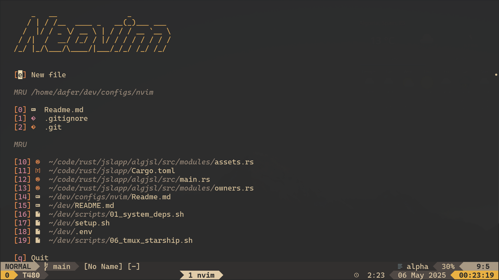
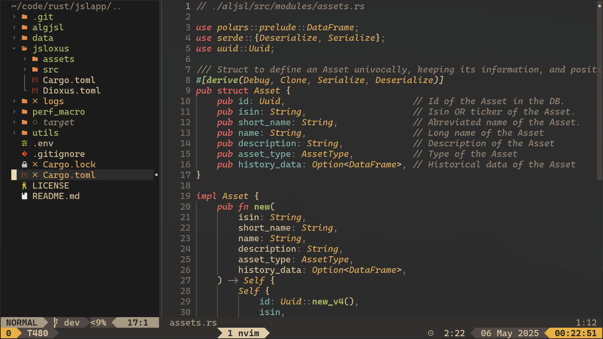
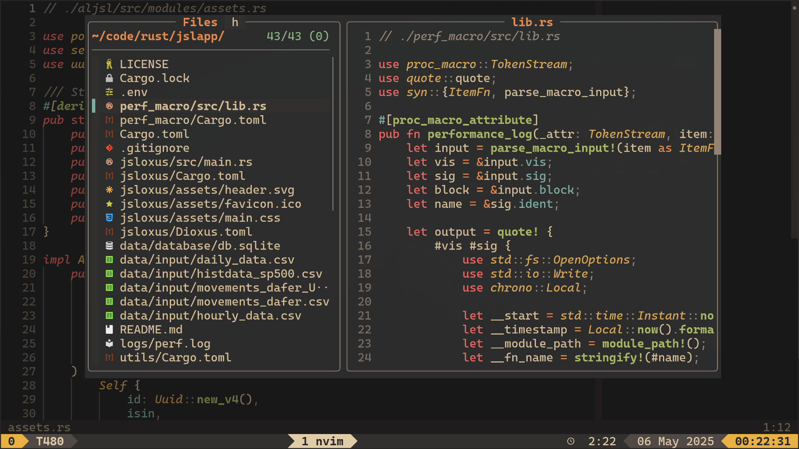
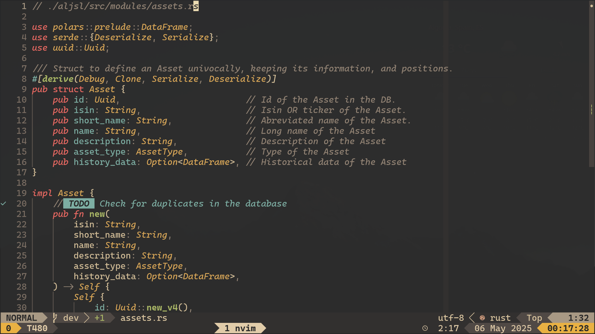
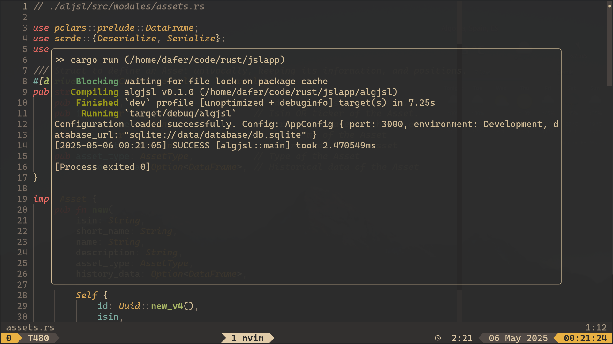
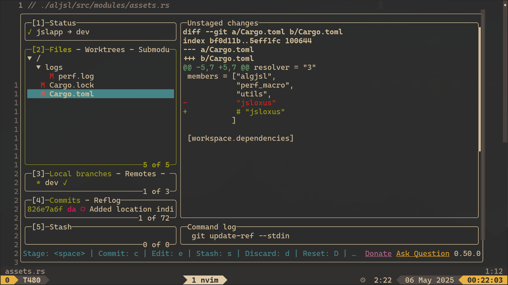

# Neodafer (custom neovim configuration lua files)

Files related to my neovim configuration. Installed along with [my other dotfiles](https://github.com/Danisaski/dotfiles).

^[Custom landing page using 'alpha-nvim'.]

^['nvim-tree' with some tweaks.]

^['fzf-lua' for fuzzy finding and navigating.]

^[Matching colorscheme in all statuslines.]

^[Running a Rust project by pressing <leader>r]

^[Some utils embedded]
